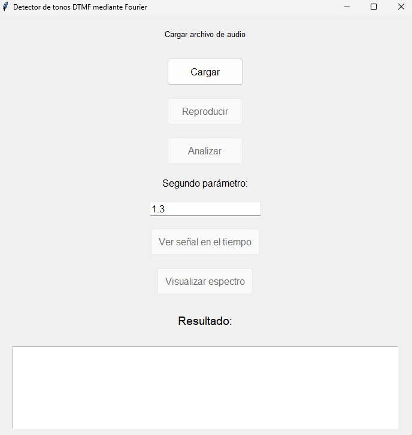

# Detector de tonos DTMF mediante Fourier

Este proyecto es una aplicación de escritorio que permite cargar un archivo de audio y analizarlo para detectar tonos DTMF utilizando la transformada de Fourier.

## Requisitos

Para ejecutar la aplicación, se requiere tener instalado Python 3 y las siguientes librerías:

- tkinter
- pyaudio
- numpy
- scipy
- matplotlib

## Uso

Para ejecutar la aplicación, simplemente ejecute el archivo `python main.py`

Una vez que se abra la ventana de la aplicación, siga los siguientes pasos:

1. Haga clic en el botón "Cargar" para cargar un archivo de audio.
2. Haga clic en el botón "Reproducir" para reproducir el archivo de audio cargado.
3. Ingrese un valor para la segmentación en el campo de entrada de texto (de ser necesario).
4. Haga clic en el botón "Analizar" para analizar el archivo de audio cargado y mostrar los resultados en la ventana de resultados.

## Estructura del código

El código se divide en dos archivos:

- `main.py`: Contiene las funciones para analizar el archivo de audio y visualizar los resultados.
- `gui.py`: Contiene la interfaz gráfica de usuario de la aplicación.

La clase `GUI` en el archivo `gui.py` es la clase principal de la aplicación y contiene los métodos para cargar el archivo de audio, reproducir el archivo de audio, analizar el archivo de audio y visualizar los resultados.

## Créditos

Este proyecto fue desarrollado por [Juan Bermúdez](https://github.com/juan154850/) y [Harold Gómez](https://github.com/Solomonpearce) como parte del curso de Procesamiento Digital de Señales.
